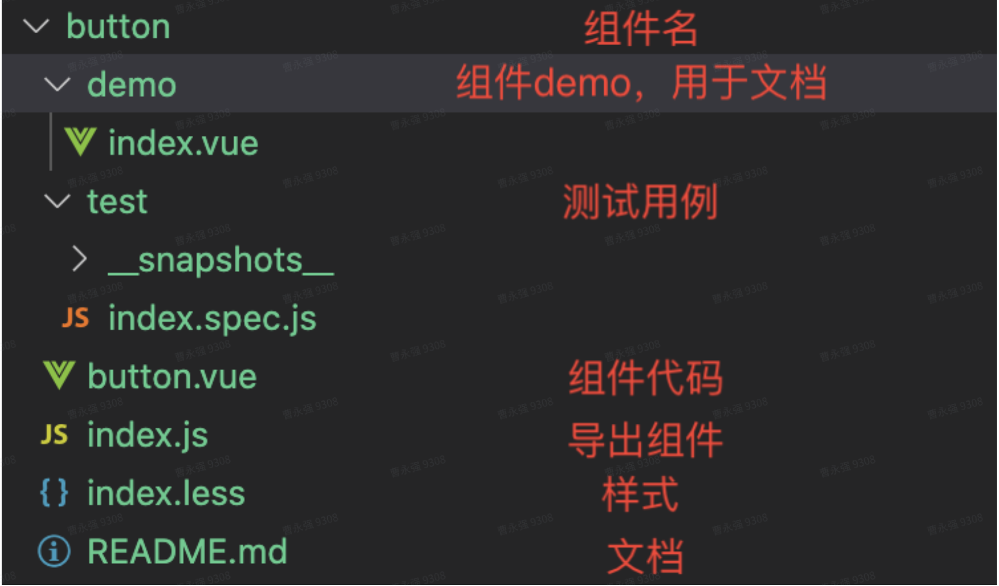

# 组件开发规范

## 文件规范



## 命名规范

采用BEM命名规范，所有组件均以`tm-`开头，例如：`tm-button`

### Block

1、封装一个只对自己有意义的实体。当blocks能够被嵌套而且彼此之间可以交互的时候，语义上他们是等价的；没有层级关系。没有DOM表示的整体实体。（例如控制器和模型也可以是块）

2、`Naming Block`的名字包含拉丁字母、数字和句号。当组合一个完整`css class`的时候，可以增加一个短的前缀：`.block`

3、HTML任何DOM节点可以作为一个Block，只要他接受一个class名。
````html
<div class="block"></div>
````

4、CSS

* 只使用class名选择器
* 没有标签名或者id
* 同一页面里，不依赖其他的block或者element
* 例如`.block { color: red }`

### Element

1、Block的一部分，当把它独立取出来时，没有任何实际意义。任何元素在语义上都是他自己的block紧密相连的

2、`Naming Element`的名字包含拉丁字母、数字、句号以及下划线。`CSS class名`由block名加两个下划线再加element的名字，最后组合成一个块名

3、HTML任何的在Block中的DOM节点，都是一个element。在一个已知的block中，所有的element在语义上都是相等的

````html
<div class="block">
  <span class"block__name"></span>
<div>
````

4、CSS

* 只使用class名选择器
* 没有标签名或者id
* 不依赖当前页面的其他block或者element

Good
````css
.block__element { color: red }
````

Bad
````css
.block .element { color: red }
div.block__element { color: red }
````

### Modifier

1、block或者element的flag。使用他们可以改变样式、行为或者是状态

2、`Naming Modifier`的名字包含拉丁字母、数字、句号以及下划线。`CSS class名`可以由block或者element名称后面加--组成

> 例如：block--modifier或者block__element--modifier，以及block--color-black block--color-red。复杂的modifier里由`短线替代空格`

3、`HTML Modifier`是一个额外加在block或者element class名之后一个class名。只为他们负责修改的blocks或者elements添加class，然后保持原有的class名不变

Good

````html
<div class="block block--modifier">...</div>
<div class="block block--size-big block-shadow-yes">...</div>
````

Bad

````html
<div class="block--mod">...</div>
````

### CSS

1、使用`modifier`类名作为选择器 `.block--hidden {}`

2、基于block级的modifier修改元素 `.block--mod .block__elem {}`

3、元素修改器 `.block__elem--mod {}`

#### 例子：

假如你的form Block由modifier: theme:xmas、simple:true以及element:input和submit，submit自己的modifier是disabled:true。

````html
<form class="form form--eheme-xms form--simple">
  <input class="form__input" type="text" />
  <input class="form__submit form__submit--disabled" type="submit" />
</form>
````

````css
.form {}
.form--theme-xmas {}
.form--simple {}
.form__input {}
.form__submit {}
.form__submit--disabled {}
````

## README规范

1、Props

* 参数：采用中划线命名(page-size)

* 类型：多个类型采用分割线(number|string)

2、Events

参照Element UI(事件名称|说明|回调参数)，[链接地址](https://element.eleme.cn/#/zh-CN/component/pagination#events)

3、Slot

参照Element UI(name|说明)，[链接地址](https://element.eleme.cn/#/zh-CN/component/pagination#slot)
