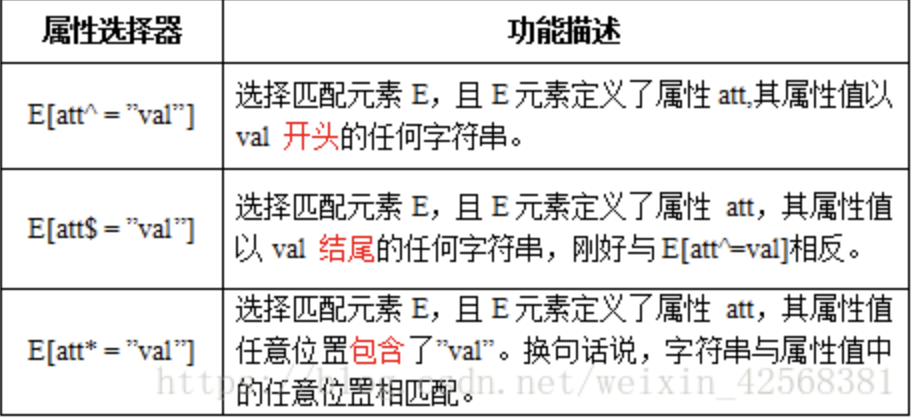
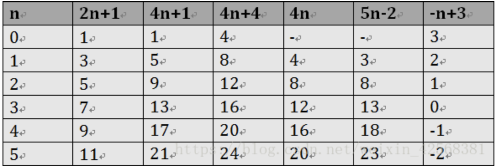

# CSS3选择器大全

## 属性选择器

在HTML中，通过各种各样的属性可以给元素增加很多附加的信息。例如，通过id属性可以将不同div元素进行区分。

````css
input[type="text"]{
  width:150px;
  display:block;
  margin-bottom:10px;
  background-color:yellow;
  font-family: Verdana, Arial;
}
````

在CSS2中引入了一些属性选择器，而CSS3在CSS2的基础上对属性选择器进行了扩展，新增了3个属性选择器，使得属性选择器有了通配符的概念， 这三个属性选择器与CSS2的属性选择器共同构成了CSS功能强大的属性选择器。如下表所示：



## root

`:root选择器`，从字面上我们就可以很清楚的理解是根选择器，他的意思就是匹配元素E所在文档的根元素。在HTML文档中，根元素始终是`<html>`。 :root选择器等同于<html>元素，简单点说：

````css
:root{background:orange}
html {background:orange;}
````

得到的效果等同。 建议使用:root方法。

## not

`:not选择器`称为否定选择器，和jQuery中的:not选择器一模一样，可以选择除某个元素之外的所有元素。 就拿form元素来说，比如说你想给表单中除submit按钮之外的input元素添加红色边框，CSS代码可以写成：

````css
input:not([type="submit"]){
  border:1px solid red;
}
````

## empty

`:empty选择器`表示的就是空。用来选择没有任何内容的元素，这里没有内容指的是一点内容都没有，哪怕是一个空格。 比如说，你的文档中有三个段落p元素，你想把没有任何内容的P元素隐藏起来。我们就可以使用`:empty选择器`来控制。

````css
p:empty {
  display: none;
}
````

## target

`:target选择器`称为目标选择器，用来匹配文档(页面)的url的某个标志符的目标元素。

## first-child

`:first-child选择器`表示的是选择父元素的第一个子元素的元素E。 简单点理解就是选择元素中的第一个子元素，记住是子元素，而不是后代元素。

## last-child

`:last-child选择器`与`:first-child选择器`作用类似，不同的是:last-child选择器选择的是元素的最后一个子元素。

nth-child(n)

`:nth-child(n)选择器`用来定位某个父元素的一个或多个特定的子元素。 其中“n”是其参数，而且可以是整数值(1,2,3,4)，也可以是表达式(2n+1、-n+5)和关键词(odd、even)，但参数n的起始值始终是1，而不是0。 也就是说，参数n的值为0时，选择器将选择不到任何匹配的元素。

经验与技巧:当“:nth-child(n)”选择器中的n为一个表达式时，其中n是从0开始计算，当表达式的值为0或小于0的时候，不选择任何匹配的元素。如下表所示： 



## only-child

`:only-child选择器`选择的是父元素中只有一个子元素，而且只有唯一的一个子元素。 也就是说，匹配的元素的父元素中仅有一个子元素，而且是一个唯一的子元素。

## enabled和disabled
在Web的表单中，有些表单元素有可用（“`:enabled`”）和不可用（“`:disabled`”）状态，比如输入框，密码框，复选框等。 在默认情况之下，这些表单元素都处在可用状态。那么我们可以通过`伪选择器:enabled`对这些表单元素设置样式。

`:disabled选择器`刚好与`:enabled选择器`相反，用来选择不可用表单元素。要正常使用:disabled选择器，需要在表单元素的HTML中设置“disabled”属性。

## checked

在表单元素中，单选按钮和复选按钮都具有`选中`和`未选中`状态。（大家都知道，要覆写这两个按钮默认样式比较困难）。 在CSS3中，我们可以通过状态选择器`:checked`配合其他标签实现自定义样式。而:checked表示的是选中状态。

## selection

`::selection伪元素`是用来匹配突出显示的文本(用鼠标选择文本时的文本)。 浏览器默认情况下，用鼠标选择网页文本是以“深蓝的背景，白色的字体”显示的。

## read-only和read-write

`:read-only伪类选择器`用来指定处于只读状态元素的样式。 简单点理解就是，元素中设置了“readonly=’readonly’”

`:read-write选择器`刚好与`:read-only选择器`相反，主要用来指定当元素处于非只读状态时的样式。

::before和::after

`::before`和`::after`这两个主要用来给元素的前面或后面插入内容，这两个常和`”content”`配合使用，使用的场景最多的就是清除浮动。