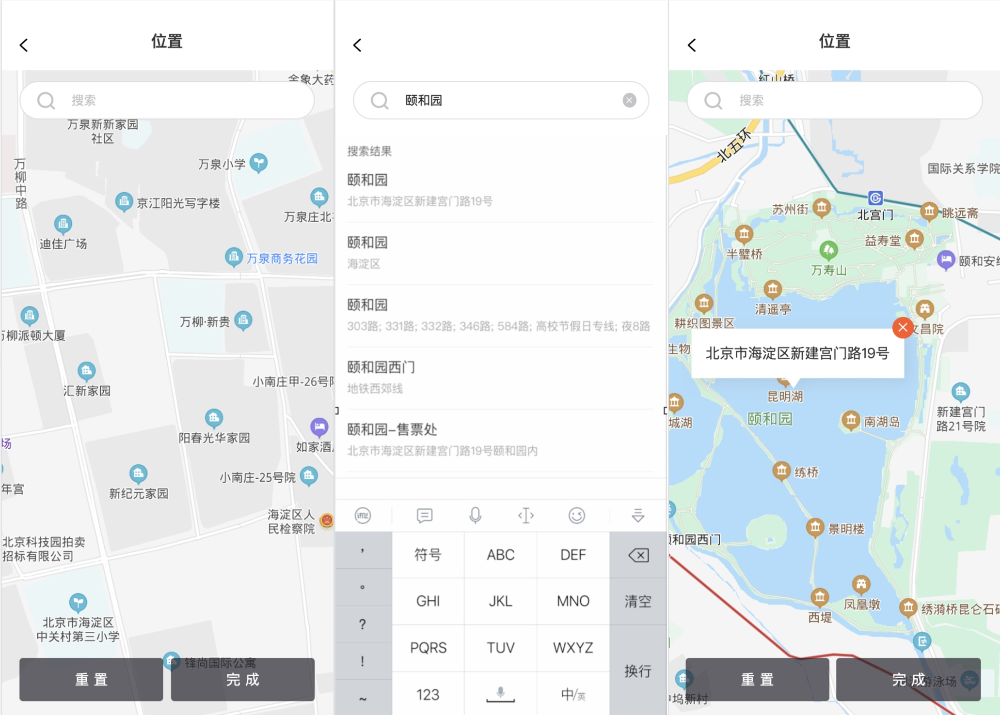

# map组件的使用

实现效果如下



## wxml

````html
<view class="position">
  <view
    wx:if="{{ addListShow }}"
    class="search-mainbody"
  >
    <view class="search-area">
      <view class="search-box">
        <view class="iconfont iconfangdajing search-icon"></view>
        <input
          class="search-input"
          type="text" 
          placeholder="搜索"
          focus
          value="{{ searchValue }}"
          placeholder-class="self-placeholder"
          bindinput="handleSearchChange"
        />
        <van-icon
          wx:if="{{ showClear }}"
          name="clear" 
          size="16px" 
          color="#AEAFAF"
          bind:click="handleClear"
        />
      </view>
      <view
        wx:if="{{ searchLists.length }}"
        class="search-result-tips">搜索结果</view>
    </view>
    <view class="address-list">
      <view 
        class="search-item" 
        wx:for="{{ searchLists }}" 
        wx:key="{{ item.id }}"
        data-index="{{ index }}"
        bind:tap="handleSelectAddress"
      >
        <view class="address-title">{{ item.title }}</view>
        <view class="address-detail">{{ item.addr }}</view>
      </view>
    </view>
  </view>
  <map
    wx:if="{{ !addListShow }}"
    id="myMap"
    style="width:100%;height:100%;"
    longitude="{{ longitude }}"
    latitude="{{ latitude }}" 
    markers="{{ markers }}"
    scale="17"
  >
    <cover-view class="position-ele search-box map-search">
      <cover-view class="iconfont iconfangdajing search-icon"></cover-view>
      <cover-view class="search-input" bindtap="showAddList">搜索</cover-view>
    </cover-view>
    <cover-view class="position-ele control-btn-group">
      <cover-view class="reload-btn" bindtap="handleReload">重置</cover-view>
      <cover-view class="complete-btn" bindtap="handleComplete">完成</cover-view>
    </cover-view>
  </map>
</view>
````

## js

````js
const QQMapWX = require('../../../assets/qqmap-wx-jssdk.min.js');
const computedBehavior = require('miniprogram-computed');
let qqmapsdk;
Page({
  behaviors: [computedBehavior],
  data: {
    atitude: '',
    longitude: '',
    addListShow: false,
    searchValue: '',
    selectAddress: {},
    searchLists: [],
    markers: [],
  },
  computed: {
    showClear(data) {
      return !!data.searchValue;
    }
  },
  onLoad () {
    this.mapCtx = wx.createMapContext('myMap')
    // 实例化API核心类
    qqmapsdk = new QQMapWX({
      key: '5BZBZ-K4NWX-ZX44C-ZFYBR-PINWO-VAF74'
    });
    wx.showLoading({
      title: '加载中'
    });
    //定位
    wx.getLocation({
      type: 'wgs84',
      success: (res) => {
        const latitude = res.latitude
        const longitude = res.longitude
        // 地址解析
        qqmapsdk.reverseGeocoder({
          location: {
            latitude,
            longitude
          },
          success: ({result}) => {
            const info = {
              latitude,
              longitude,
              addr: result.address
            };
            this.setMarkers(info);
            this.setData({
              latitude,
              longitude,
              selectAddress: info,
              currentRegion: result.address_component,
            })
            wx.hideLoading({});
          },
        });
      },
      fail(err) {
        wx.hideLoading({});
        wx.showToast({
          title: '定位失败',
          icon: 'none',
          duration: 1500
        })
      }
    })
  },
  handleSearchChange(e) {
    this.setData({
      searchValue: e.detail.value.trim()
    });
    this.setData({
      addListShow: true
    })
    //调用关键词提示接口
    qqmapsdk.getSuggestion({
      //获取输入框值并设置keyword参数
      keyword: this.data.searchValue,
      location: this.data.latitude + ',' + this.data.longitude,
      page_size: 20,
      page_index: 1,
      //region:'北京', //设置城市名，限制关键词所示的地域范围，非必填参数
      success: (res) => {//搜索成功后的回调
        let lists = [];
        for (const i of res.data) {
          lists.push({ // 获取返回结果，放到sug数组中
            title: i.title,
            id: i.id,
            addr: i.address,
            province: i.province,
            city: i.city,
            district: i.district,
            latitude: i.location.lat,
            longitude: i.location.lng
          });
        }
        this.setData({
          searchLists: lists
        });
      },
      fail: (error) => {
      },
      complete: (res) => {
      }
    });
  },
  handleSelectAddress(e) {
    const { index } = e.currentTarget.dataset;
    const info = this.data.searchLists[index];
    this.setData({
      selectAddress: info,
      addListShow: false
    });
    this.setMarkers(info);
    this.setData({ 
      latitude: info.latitude,
      longitude: info.longitude
     });
    const timer = setTimeout(() => {
      this.mapCtx.translateMarker({
        markerId: 1,
        duration: 1000,
        destination: {
          latitude: info.latitude,
          longitude: info.longitude
        },
        animationEnd: () => {
          clearTimeout(timer);
        },
      })
    }, 0);
  },
  /**
   * 清空搜索框内容
   */
  handleClear() {
    this.setData({
      searchValue: ''
    });
  },
  showAddList() {
    this.setData({
      addListShow: true,
      searchLists: [],
      searchValue: ''
    });
  },
  handleReload() {
    this.setData({
      selectAddress: {},
      markers: []
    });
  },
  handleComplete() {
    var pages = getCurrentPages();
    var prevPage = pages[pages.length - 2];
    prevPage.setData({
      chooseAddressInfo: this.data.selectAddress
    })
    wx.navigateBack({
      delta: 1
    })
  },
  setMarkers(info) {
    const markers = [
      {
        id: 1,
        latitude: info.latitude,
        longitude: info.longitude,
        callout: {
          content: info.addr,
          display: 'ALWAYS',
          anchorY: -4,
          padding: 10
        }
      }
    ]
    this.setData({
      markers
    });
  }
});
````

## wxss

````css
/* 样式使用 less 编辑为 wxss */
.position {
  height: 100%;
  overflow: hidden;
  .search-box {
    display: flex;
    align-items: center;
    height: 88rpx;
    padding: 0 32rpx;
    color: #AEAFAF;
    border-radius: 44rpx;
    border: 1px solid rgba(221, 223, 227, 1);
    background-color: #ffffff;
    .search-input {
      flex: 1;
      height: 100%;
      margin-left: 30rpx;
      line-height: 88rpx;
      font-size: 28rpx;
    }
  }
  .search-icon {
    font-weight: bold;
    color: #AEAFAF;
  }
  .search-mainbody {
    display: flex;
    flex-direction: column;
    padding: 0 32rpx;
    height: 100%;
    .search-area {
      padding-top: 20rpx;
      .search-input {
        margin: 0 10rpx 0 30rpx;
      }
      .search-result-tips {
        margin-top: 30rpx;
        color: #AEAFAF;
        font-size: 28rpx;
        padding-bottom: 6rpx;
      }
    }
    .address-list {
      flex: 1;
      overflow-x: hidden;
      .search-item:not(:last-child){
        border-bottom: 1px solid #DCDDDF;
      }
      .search-item {
        font-size: 30rpx;
        color: #151A28;
        padding: 20rpx 0;
        .address-detail {
          margin-top: 6rpx;
          color: #AEAFAF;
          font-size: 24rpx;
        }
      }
    }
  }
  // 地图上元素样式
  .position-ele {
    position: absolute;
    left: 32rpx;
    right: 32rpx;
  }
  .map-search {
    top: 20rpx;
  }

  .self-placeholder {
    color: #AEAFAF;
  }
  .control-btn-group {
    display: flex;
    bottom: 30rpx;
    height: 96rpx;
    color: #ffffff;
    .reload-btn, .complete-btn {
      flex: 1;
      text-align: center;
      line-height: 96rpx;
      font-size: 32rpx;
      border-radius: 10rpx;
      background-color: rgba(37, 36, 45, .7);
    }
    .reload-btn {
      margin-right: 20rpx;
    }
  }
}
````