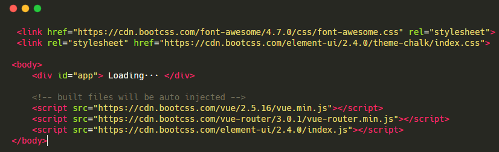

# vue首屏加载优化

## 1. cdn方式

把不常改变的库放到`index.html`中，通过`cdn`的方式引入



然后在 `build/webpack.base.conf.js`中，在`module.export = {}` 添加以下代码

````js
externals: {
  'vue': 'Vue',
  'vue-router': 'VueRouter',
  'element-ui': 'ELEMENT',
}
````

这样 `webpack` 就不会把 `vue.js`, `vue-router`, `element-ui` 库打包了。声明一下，我把 `main.js` 中对 `element` 的引入删掉了，不然我发现打包后的 `app.css` 还是会把 element 的 css 打包进去，删掉后就没了。
然后你打包就会发现 `vendor` 文件小了很多~

## 2. 路由懒加载

`import`或者`require`懒加载。你打包就会发现，多了很多 1.xxxxx.js；2.xxxxx.js 等等，而 vendor.xxx.js 没了，剩下 app.js 和 manifest.js，而且 app.js 还很小，我这里是 100k 多一点。

## 3. 不生成map文件

找到 `config/index.js`，修改为 `productionSourceMap: false`;

## 4. vue组件尽量不要全局引入

## 5. 使用轻量级的工具库

## 6. 开启gzip压缩

这个优化是两方面的，前端将文件打包成.gz文件，然后通过nginx的配置，让浏览器直接解析.gz文件

## 7. 首页单独做服务端渲染

如果首页真的有瓶颈，可以考虑用 node 单独做服务端渲染，而下面的子页面仍用 spa 单页的方式交互。
这里不推荐直接用 nuxt.js 服务端渲染方案，因为这样一来增加了学习成本，二来服务端的维护成本也会上升，有时在本机测试没问题，在服务端跑就有问题，为了省心，还是最大限度的使用静态页面较好。