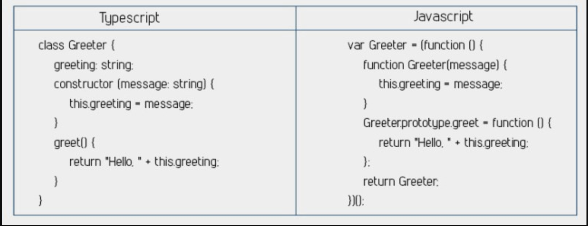
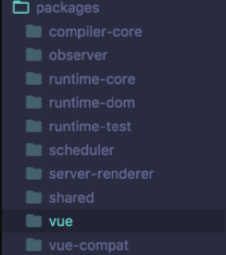

# Vue3

## Vue3 使用基于Proxy的观察者

响应式是VueJS的核心，它需要数据有依赖，观察、更新数据来反应任何变化。

Vue2使用 `Object.defineProperty` 去创建 `getters` 和 `setters` 实现响应式。

使用 `Object.defineProperty` 这里有两个主要的问题，事实上，他们足够了，甚至在[官方文档](https://cn.vuejs.org/v2/guide/reactivity.html)中也提到了:

1. 响应式属性不能够动态添加、删除
2. 这里有两个关于动态数组的问题
    通过下标设置元素不是响应式的
    修改数组长度是非响应式的

    ````javascript
    // 通过下标设置数组元素 - 非响应式
    vm.items[itemOfItem] = newVal
    // 修改数组长度 - 非响应式
    vm.items.length = newLength
    ````
### 为什么使用基于Proxy的观察者

Vue3的解决方案是基于 `Proxy` 的观察者，避免了原来的功能限制。

老版本和新版本的关键区别，Vue2中Object.defineProperty改变原始数据但是Proxy没有。它使用虚拟化的目标数据，设置不同的处理方法来监听数据的getters和setters。

这个新的方式意味着响应式属性能够在不使用`vm.$set`的情况下添加、删除属性。它也消除了Vue2中关于数组的无效极端情况。

基于Proxy的观察者能够支持一下方面：

* 监测属性的添加、删除
* 监测数组下标和长度的变化
* 支持 Map、Set、WeakMap、WeakSet

## 介绍下 Composition API

在Vue3中这是迄今为止最著名的变化，它能够帮助我们组织、重用代码。

现在如果你在工作中使用Vue，你应该应该用过 **Options Api**，Options API通过：`data`、`computed`、`methods`等等属性来组织我们的代码。

这是一个非常直观的系统，吸引了成千上万的人尝试VueJS，但是它让维护一个巨大的组件非常困难。针对一个功能的代码被分散到几个地方，每个地方相隔数百行。

**可维护性、可读性变成了主要的问题**

让我们看下 Composition API 是如何工作的。

````javascript
import { reactive, computed } from 'vue'
export default {
setup(){
    // vue composition api 暴露vue的核心响应式能力
    let state = reactive({
        input: '',
        groceries: [],
        groceriesLeft: computed(() => groceries.length)
    });
    function addGrocery() {
        state.groceries.push(state.input);
        state.input = '';
    }
    function deleteGrocery(index) {
        state.groceries,splice(index, 1);
    }
    return {
        state,
        addGrocery,
        deleteGrocery
        }
    }
}
````

让我们逐步分解发生了什么

````javascript
import { reactive, computed } from 'vue'
````
Vue Composition API暴露了Vue中的很多核心能力，比如响应式、组件方法，所以我们来引入他们。

````javascript
export default {
    setup() {}
}
````

`setup`方法是Vue3中最大的变化之一，本质上，它能够让我们确定将哪些传递给模板，无论返回什么都可以在模板中访问。

我们能够设置响应式数据、生命周期钩子、计算属性、定义方法，返回任何我们想要的东西。

````javascript
let state = reactive({
    input: '',
    groceries: [],
    groceriesLeft: computed(() => groceries.length)
});
````

通过将所有数据包装在响应式方法里，内部所有的都变成了响应式的。这个状态模式来自 [Composition API](https://vue-composition-api-rfc.netlify.com/#api-introduction) 文档。

一个值得注意的是我们声明 `groceriesLeft` 变量的方式，你能看到，它是一个计算属性，并且定义在setup方法中。不再有分开声明的计算属性了。

````javascript
function addGrocery() {
    state.groceries.push(state.input);
    state.input = '';
}
function deleteGrocery(index) {
    state.groceries,splice(index, 1);
}
````

这是典型的函数，唯一独特的事我们需要通过状态对象访问所有定义在状态对象中的响应式数据。但是这不是Vue3特有的，它就是普通JavaScript对象。

````javascript
return {
    state,
    addGrocery,
    deleteGrocery
}
````

最后，我们想要在setup方法返回这些函数，这让属性和方法能够在模板中被访问。

## 你可以在Vue中使用Suspense

`Suspense`是React的功能，现在Vue3中也能使用。它能让你在页面准备好且页面载入完成后，在你的组件中展示后备内容。

当你在setup方法中异步载入内容是很有用的。看一下Vue-Next仓库，看起来setup是一个异步方法并且返回Promise。这个Promise能够被Suspense组件捕获，渲染后备内容直到它返回。

Suspense能够用来：

* 创建loading页面
* 等待 API 回调

几乎任何类型的数据请求或者异步的setup方法
这可能实现起来很简单，你要做的全部就是将你的代码包裹在Suspense组件中，定义你的主要内容和后备内容。

````javascript
<Suspense>
    <template >
        <Suspended-component />
    </template>
    <template #fallback>
        Fallback Content
    </template>
</Suspense>
````

如果你想了解更多关于Suspense的内容，或者你想使用它，查看VueSchool 文章

## Vue3中的片段(Fragments)

**`片段(Fragments)`是没有根元素的组件。Vue2中，每一个组件必须有且仅能有一个根元素。**

这可能让人头疼。

在一些用例中，使一个组件返回几个子元素是很简单的事情。例如，让我们用React举个例子，表格结构有一个叫Column的自定义组件。

````javascript
<table>
    <tr>
        <Columns />
    </tr>
</table>
````

为了是编译的HTML有效，Columns组件需要返回元素。但是目前，作为Vue的组件需要一个单独的根元素。

Columns组件的模板可能像这样，这会引起问题。

````javascript
<div>
    <td>Hello</td>
    <td>World</td>
</div>
````
这个时候`片段(Fragments)`就派上用场了，它允许你返回多个元素从而让上面的问题能够很简单的解决。

在Vue3中片段(Fragments)组件可能像下面这样。

````javascript
<Fragment>
    <td>Hello</td>
    <td>World</td>
</Fragment>
````

然后，因为这将返回两个元素，所以表格将显示正常。

````javascript
<table>
    <tr>
        <td>Hello</td>
        <td>World</td>
    </tr>
</table>
````

完美！

现在，有一个非官方的Vue [片段(Fragments)组件库](https://github.com/y-nk/vue-fragment)，它使用内部指令获取了组件的所有子元素然后移动到合适的位置。

## Portals

**`Portals` 是React原生包含的另一个功能，现在计划在Vue3中实现。**

`Portals` 允许你跨组件传递内容，这意味着你能够在当前组件的作用域之外编辑内容。

当你在向popup、sidebar或者其他类似组件发送内容时这是非常有帮助的。

和片段(Fragments)一样，也有一个非官方的[Vue版本 Portal 库](https://github.com/LinusBorg/portal-vue)，它在Vue2中带来了这个功能。根据 vue-next repo，Portals将包含在Vue3中。

这是一个来自 protal-vue 文档中的举例的代码截图。


````javascript
<template>
    <div>
        <div>
        <p>
            下面的内容渲染在PortalVue实现的右侧红色的容器中
        </p>
        <Portal to="right-baisc">
            <p class="red">
            这是左侧绿色容器的内容。
            最酷的是，他能够跨组件，所以你能够向任何地方传递内容。
            </p>
        <Portal>
        </div>
    </div>
</template>
````

Vue3中Portals的语法和使用方式现在任然不明确，但是应该会和这个相似。

## Vue3优化了渲染

Vue3中很大一块工作就是使它更快、更有效率。实际上，根据尤雨溪在多伦多VueConf上的演讲，内部测试表明模板样式在Vue3中比Vue2速度提升了120%。

有两个关键的优化帮助提升了Vue3的渲染速度：

* 块级树的优化
* 静态树的缓存(Hoisting)

让我们详细说说上面的两点。

### 块级树优化

使用虚拟DOM渲染有一个自然的瓶颈，因为每个组件要跟踪自己的依赖。

观察这些依赖非常慢，因为它递归的检查整个元素树去监测变化。

Vue团队注意到在组件中的一件事，一个节点结构中大多数是静态的。如果一个某个部分实际上是动态的（因为v-if或者v-for指令），那么它内部的许多内容时静态的。


由此，Vue3将模板划分为静态和动态部分。现在渲染器知道哪些节点是动态的，它不会浪费时间去检查静态节点的变化。

这真的减少了大量需要去被动观察的元素的数量。

结合所有的节点去创建一个块级树，或者一个模板根据指令（v-if/v-for）划分为节点块。

在块级树中，每个节点有以下：

* 一个静态节点结构
* 静态内容不需要被观察
* 动态节点能够被存储在平级数组中


这消除了需要去递归的检查每个元素的需求，大大改善了运行时。

### 静态树缓存(Hoisting)

静态树提升并不是新提出的（Vue2中已经存在），Vue3有更多颠覆性技术去提升项目速度。正如名字说表达，静态书提升不会重新渲染没有任何依赖的静态节点。相反，它会重用相同节点。

这极大的减少了虚拟DOM的工作，同时节省了大量项目开销，主要是垃圾收集方面。

在Vue3中，静态缓存更有颠覆性，以便尽可能高效的工作。

## Typescript支持

另一个变化是，Vue的代码库使用 [Typescript](https://www.tslang.cn/docs/home.html) 重新写了一遍。再次重申，一个主要的问题是强制用户学习Typescript将提高Vue3的上手门槛。

所以Vue团队让他对我们来说很简单，如果你想要Typescript，使用他。如果你不想要，仍然可以使用JavaScript。两种都可以。



如果你像我一样，你可能会问“为什么用Typescript”。

先不说其他，Typescript允许你给变量添加类型信息。这能够极大的帮助你维护一个长期运行的项目。

再者，当你工作的IDE支持Typescript，在开发过程中能够自动补全和展示类型信息。

这都有你决定，事实上使用Typescript写Vue库开发者将受益，即使他们继续使用JavaScript。

自从新的Vue代码库使用Typescript，即使你使用JavaScript，自动补全、类型信息和最终文档都能够从IDE中得到。这将节省你多次访问Vue文档的时间。

## 它非常轻量

现在，VueJS已经非常小（gzip后20Kb），但是Vue团队面临一个问题，无论用户是否使用，新功能将增加构建包的大小。

为了修复这个问题，Vue3将更加模块化。当然这将增加你在开发时import的次数，这确保了你的项目中没有不使用的库。

多亏了Tree shaking（消除非重要代码），Vue3中减少的代码大概有gzip后10Kb。当然，许多库将被重新引入，但是没关系，我们并不会被强迫使用所有东西。



实际上，开发者不用为他们从不使用的功能付出代价。
