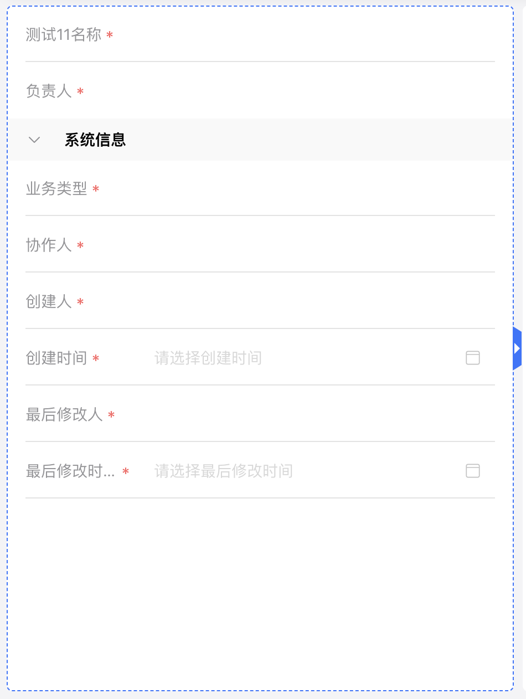

# vue3拖拽调整宽度指令

## 介绍

一个`vue3`的拖拽指令，用于调整元素的宽度。特点是：往左拖只会影响该元素本身和左边元素的宽度，往右拖只会影响该元素本身和右边元素的宽度。



## 使用

1、在`main.ts`中导入该指令并完成注册

```ts
import { createApp } from 'vue'
import resizeDirective from "./directive/resizableDirective";
const app = createApp(App)
app.directive("resizable", resizeDirective);
```

2、在需要拖拽的元素上添加`resizable`指令

```html
<div class="box" v-resizable="config"></div>
```

```ts
<script setup lang="ts">
const config = {
  enableDrag: true,
  enableLeftDrag: false
}
</script>
```

## 详解

1、支持以下配置：

| 属性 | 说明 | 类型 | 默认值 |
| --- | --- | --- | --- |
enableDrag | 是否启用拖拽 | Boolean | true |
enableLeftDrag | 是否启用左拖拽 | Boolean | true |
enableRightDrag | 是否启用右拖拽 | Boolean | true |
minWidth | 最小宽度 | Number | 280px |
preMinWidth | 上一个兄弟元素的最小宽度，拖拽到最小宽度时，拖拽元素宽度不会变小 | Number | 280px |
nextMinWidth | 下一个兄弟元素的最小宽度，拖拽到最小宽度时，拖拽元素宽度不会变小 | Number | 280px |
gap | 元素和兄弟元素之间的间距 | Number | 8px |

2、事件

拖拽过程中会触发相关事件，用于做某些处理

| 事件名 | 说明 | 参数 |
| --- | --- | --- |
updateWidth | 拖拽过程中触发 | 拖拽元素宽度 |
updatePreviousWidth | 拖拽过程中触发 | 拖拽元素上一个兄弟元素宽度 |
updateNextWidth | 拖拽过程中触发 | 拖拽元素下一个兄弟元素宽度 |


3、配置的`interface`信息

```ts
export interface ResizeConfig {
  enableDrag?: boolean;
  enableLeftDrag?: boolean; 
  enableRightDrag?: boolean; 
  minWidth?: number; 
  preMinWidth?: number; 
  nextMinWidth?: number;
  gap?: number;
}
```

## 具体代码

```ts
import type { DirectiveBinding } from "vue";

export interface ResizeConfig {
  enableDrag?: boolean; // 是否开启拖拽
  enableLeftDrag?: boolean; // 是否开启左边拖拽
  enableRightDrag?: boolean; // 是否开启右边拖拽
  minWidth?: number; // 允许拖拽最小宽度
  preMinWidth?: number; // 上一个兄弟元素的最大宽度，避免拖拽时被过度挤压
  nextMinWidth?: number; // 后一个兄弟元素的最大宽度，避免拖拽时被过度挤压
  gap?: number; // 元素与元素的间隙
}

const createResizeBlock = (
  direction: "left" | "right",
  startDrag: Function
): HTMLDivElement => {
  const block = document.createElement("div");
  const icon = document.createElement("i");
  block.className = "apaas-editor-resizable";
  block.style.height = "40px";
  block.style.position = "absolute";
  block.style.cursor = "col-resize";
  block.style[direction] = "-8px";
  block.style.top = "50%";
  block.style.transform = "translateY(-50%)";

  icon.style.position = "absolute";
  icon.style.borderTop = "5px solid transparent";
  icon.style.borderBottom = "5px solid transparent";
  icon.style.top = "50%";
  icon.style.transform = "translateY(-50%)";

  if (direction === "left") {
    block.style.borderRight = "8px solid #3470ff";
    icon.style.borderRight = "5px solid #fff";
    icon.style.left = "1px";
  } else {
    block.style.borderLeft = "8px solid #3470ff";
    icon.style.borderLeft = "5px solid #fff";
    icon.style.left = "-6.5px";
  }
  block.style.borderTop = "5px solid transparent";
  block.style.borderBottom = "5px solid transparent";
  block.addEventListener("mousedown", startDrag.bind(null, direction));

  block.appendChild(icon);
  return block;
};

/**
 * 获取后边兄弟元素的总宽度
 * @param element 元素节点
 * @returns 后边兄弟元素的总宽度
 */
function getTotalWidthOfNextSiblings(element: HTMLElement): number;
/**
 * 获取后边兄弟元素的总宽度
 * @param element
 * @param includeAll 是否包括所有后边兄弟元素
 * @returns 后边兄弟元素的总宽度
 */
function getTotalWidthOfNextSiblings(
  element: HTMLElement,
  includeAll: boolean
): number;
function getTotalWidthOfNextSiblings(
  element: HTMLElement,
  includeAll: boolean = false
): number {
  let totalWidth = 0;
  let sibling = element.nextElementSibling as HTMLElement;
  // 排除后边第一个元素
  if (!includeAll && sibling !== null) {
    sibling = sibling.nextElementSibling as HTMLElement;
  }

  while (sibling) {
    totalWidth += sibling.offsetWidth;
    sibling = sibling.nextElementSibling as HTMLElement;
  }

  return totalWidth;
}

/**
 * 获取前边兄弟元素的总宽度
 * @param element 元素节点
 * @returns 前边兄弟元素的总宽度
 */
function getTotalWidthOfPreviousSiblings(element: HTMLElement): number;
/**
 * 获取前边兄弟元素的总宽度
 * @param element
 * @param includeAll 是否包括所有前边兄弟元素
 * @returns 前边兄弟元素的总宽度
 */
function getTotalWidthOfPreviousSiblings(
  element: HTMLElement,
  includeAll: boolean
): number;
function getTotalWidthOfPreviousSiblings(
  element: HTMLElement,
  includeAll: boolean = false
) {
  let totalWidth = 0;
  let sibling = element.previousElementSibling as HTMLElement;
  // 排除前边第一个元素
  if (!includeAll && sibling !== null) {
    sibling = sibling.previousElementSibling as HTMLElement;
  }

  while (sibling) {
    totalWidth += sibling.offsetWidth;
    sibling = sibling.previousElementSibling as HTMLElement;
  }

  return totalWidth;
}

/**
 * 有多少个子元素
 * @param element
 * @returns  count
 */
function getChildElementCount(element: HTMLElement): number {
  return element.childElementCount;
}

const resizeDirective = (
  el: HTMLElement,
  binding: DirectiveBinding<ResizeConfig>
) => {
  const config: ResizeConfig = Object.assign(
    {
      enableDrag: true,
      enableLeftDrag: true,
      enableRightDrag: true,
      minWidth: 280,
      preMinWidth: 280,
      nextMinWidth: 280,
      gap: 8,
    },
    binding.value || {}
  );
  const lineArr = el.querySelectorAll(".apaas-editor-resizable");
  for (const ele of lineArr) {
    ele.remove();
  }
  if (!config.enableDrag) {
    return;
  }

  const leftBlock = createResizeBlock("left", startDrag);
  const rightBlock = createResizeBlock("right", startDrag);

  // 创建左边的块, 设置左边块样式及事件处理
  if (config.enableLeftDrag) {
    el.appendChild(leftBlock);
  }

  // 创建右边的块, 设置右边块样式及事件处理
  if (config.enableRightDrag) {
    el.appendChild(rightBlock);
  }

  let startX = 0;
  let startWidth = 0;
  let isResizing = false;
  let preSiblingStartWidth = 0; // 前一个元素的宽度
  let nextSiblingStartWidth = 0; // 后一个元素的宽度

  function startDrag(direction: string, event: MouseEvent) {
    isResizing = true;
    const previousSibling = el.previousElementSibling as HTMLElement;
    const nextSibling = el.nextElementSibling as HTMLElement;
    if (previousSibling) preSiblingStartWidth = previousSibling.offsetWidth;
    if (nextSibling) nextSiblingStartWidth = nextSibling.offsetWidth;
    startWidth = el.offsetWidth;
    startX = event.clientX;

    const doDrag = (event: MouseEvent) => {
      if (!isResizing) return;
      const diffX = event.clientX - startX;
      const nextSiblingsTotalWidth = getTotalWidthOfNextSiblings(el);
      const allNextSiblingsTotalWidth = getTotalWidthOfNextSiblings(el, true);

      const previousSiblingsTotalWidth = getTotalWidthOfPreviousSiblings(el);
      const allPreviousSiblingsTotalWidth = getTotalWidthOfPreviousSiblings(
        el,
        true
      );
      const totalChildCount = getChildElementCount(
        el.parentNode! as HTMLElement
      );
      const totalGap = totalChildCount
        ? (totalChildCount - 1) * config.gap!
        : 0;

      if (direction === "left") {
        let width = startWidth - diffX;
        /**
         * 最大可设置宽度
         * 总宽度 - 前边除了第一个兄弟元素总宽度 - 后边所有元素的宽度 - 前边第一个元素允许的最小宽度 - 所有的gap
         */
        let maxT =
          (el.parentNode! as HTMLElement).clientWidth -
          previousSiblingsTotalWidth -
          allNextSiblingsTotalWidth -
          totalGap;
        if (diffX < 0 && previousSibling) {
          maxT -= config.preMinWidth!;
        }
        if (diffX > 0 && previousSibling) {
          maxT -= config.minWidth!;
        }

        width = Math.min(
          Math.max(width, config.minWidth || 0),
          maxT || Infinity
        );
        if (previousSibling) {
          const previousSiblingWidth = Math.min(
            Math.max(preSiblingStartWidth + diffX, config.preMinWidth || 0),
            maxT || Infinity
          );
          previousSibling.style.width = `${previousSiblingWidth}px`;
          el.dispatchEvent(
            new CustomEvent("updatePreviousWidth", {
              detail: previousSiblingWidth,
            })
          );
        }
        el.style.width = `${width}px`;
        el.dispatchEvent(new CustomEvent("updateWidth", { detail: width }));
        return;
      }
      if (direction === "right") {
        let width = startWidth + diffX;
        /**
         * 最大可设置宽度
         * 总宽度 - 后边除了第一个兄弟元素总宽度 - 前边所有元素的宽度 - 后边第一个元素允许的最小宽度 - 所有的gap
         */
        let maxT =
          (el.parentNode! as HTMLElement).clientWidth -
          nextSiblingsTotalWidth -
          allPreviousSiblingsTotalWidth -
          totalGap;
        if (diffX > 0 && nextSibling) {
          maxT -= config.nextMinWidth!;
        }

        if (diffX < 0 && nextSibling) {
          maxT -= config.minWidth!;
        }

        width = Math.min(
          Math.max(width, config.minWidth || 0),
          maxT || Infinity
        );
        if (nextSibling) {
          const nextSiblingWidth = Math.min(
            Math.max(nextSiblingStartWidth - diffX, config.nextMinWidth || 0),
            maxT || Infinity
          );
          nextSibling.style.width = `${nextSiblingWidth}px`;
          el.dispatchEvent(
            new CustomEvent("updateNextWidth", { detail: nextSiblingWidth })
          );
        }
        el.style.width = `${width}px`;
        el.dispatchEvent(new CustomEvent("updateWidth", { detail: width }));
        return;
      }
    };

    const stopDrag = () => {
      isResizing = false;
      document.removeEventListener("mousemove", doDrag);
      document.removeEventListener("mouseup", stopDrag);
    };

    document.addEventListener("mousemove", doDrag);
    document.addEventListener("mouseup", stopDrag);
  }
};

export default resizeDirective;
```