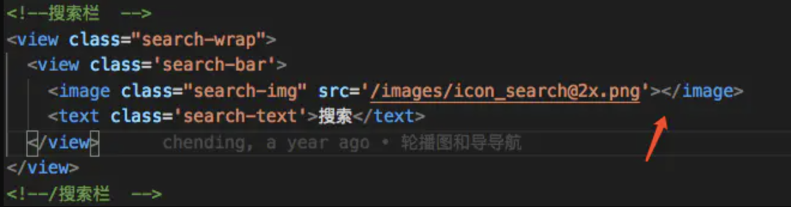

# Parsing error: x-invalid-end-tag

* 报错

````js
[eslint-plugin-vue]
[vue/no-parsing-error]
Parsing error: x-invalid-end-tag
````

* 问题原因

由于有些标签是自闭合的，所以有end标签会报错。



* .eslintrc.js中添加如下规则，并没有效果：

````js
rules:{
    'vue/no-parsing-error': [2, {
        "x-invalid-end-tag": false
    }]
}
````
* 在vscode中，需在setting.json配置如下代码

````js
 "vetur.validation.template": false
````