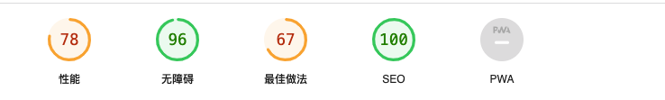
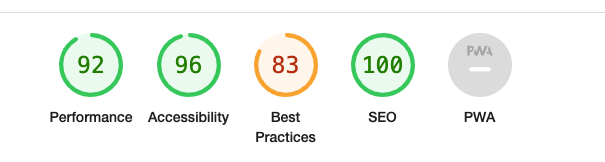
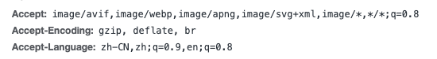
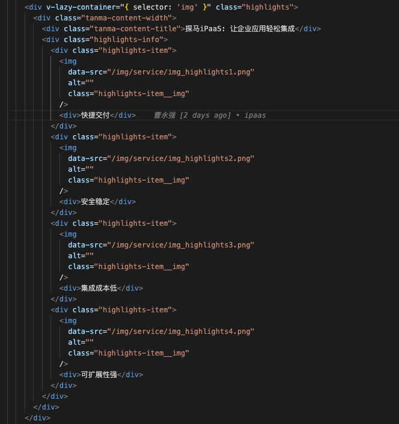
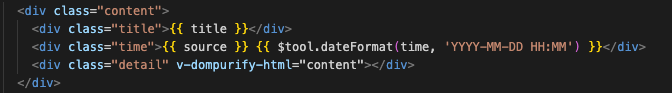

# 官网优化

## 优化效果

优化前


优化后


## 优化内容

### Element UI 按需引入

1. 安装依赖

````js
npm i element-ui babel-plugin-component 
// or 
yarn add element-ui babel-plugin-component
````
2. 在plugins下的element-ui.js写入

````js
// 引入需要使用的组件
import Vue from 'vue’ 
import { 
  Pagination, 
  Carousel, 
  CarouselItem, 
  Dialog, 
  Menu, 
  Submenu, 
  MenuItem,
  MenuItemGroup, 
  Tabs, 
  TabPane, 
  Form, 
  FormItem, 
  Input, 
  Button, 
  Message, 
  Select, 
  Option, 
} from 'element-ui'
import locale from 'element-ui/lib/locale/lang/en’

const components = [ Pagination, Carousel, CarouselItem, Dialog, Menu, Submenu, MenuItem, MenuItemGroup, Tabs, TabPane, Form, FormItem, Input, Button, Select, Option, ]; 

const Element = { install (Vue) { 
  components.forEach(component => { 
    Vue.component(component.name, component) 
  }) 
}} 
Vue.use(Element, { locale }) 
Vue.prototype.$message = Message
````

3. 在nuxt.config.js中写入

````js
plugins: ['@/plugins/element-ui'], 
build: { vendor: ['element-ui'], transpile: [/^element-ui/], babel: { 
  // 按需加载 
  plugins: [ 
    [ 'component', { 
      libraryName: 'element-ui', 
      styleLibraryName: 'theme-chalk' 
    }] 
  ] 
}}
````

### 开启gzip、br

nginx已经配置了gzip和br，所以只需在项目配置即可


1. 安装依赖

````js
npm i nuxt-precompress 
// or 
yarn add nuxt-precompress  
````

2. 在nuxt.config.js中写入

````js
nuxtPrecompress: { 
  gzip: {
    enabled: true,
    filename: '[path].gz[query]',
    threshold: 10240,
    minRatio: 0.8,
    compressionOptions: { level: 9 },
  },
  brotli: {
    enabled: true,
    filename: '[path].br[query]',
    compressionOptions: { level: 11 },
    threshold: 10240,
    minRatio: 0.8,
  },
  enabled: true,
  report: false,
  test: /\.(js|css|html|txt|xml|svg)$/,
  middleware: {
    enabled: true,
    enabledStatic: true,
    encodingsPriority: ['br', 'gzip'],
  },
}
````

### 减小打包后模块体积

````js
build: {
  optimization: {
    minimize: true,
    splitChunks: {
      minSize: 10000,
      maxSize: 250000
    }
  }
}
````
### 压缩图片
利用[tinypng网站](https://tinypng.com/)将项目中提及较大的图片进行压缩，避免出现500k的图片出现。

### 图片懒加载

1. 安装依赖

````js

npm i vue-lazyload 
// or 
yarn add vue-lazyload
````

2. 在plugins下的vue-lazyload.js写入

````js
import Vue from 'vue';
import VueLazyload from 'vue-lazyload';
const loadImage = require('../static/img/article/site.png');
const errorImage = require('../static/img/article/error.jpeg');

Vue.use(VueLazyload, {
  preload: 1.5,
  error: errorImage, //加载失败时图像的src
  loading: loadImage,
  attempt: 2,//尝试计数次数
  throttleWait: 50,//节流等待时间(通过调节此值可以查看loading的效果，根据实际情况调节)
});
````
3. 使用

把img的src替换为v-lazy

如果是本地图片可以在图片的父节点添加v-lazy-container="{ selector: 'img' }"，把img的src替换为data-src，如下所示：


### 防止xss注入

1. 安装依赖

````js
npm i vue-dompurify-html 
// or 
yarn add vue-dompurify-html
````

2. 在plugins下的vueInject.js写入

````js
import Vue from 'vue';
import VueDOMPurifyHTML from 'vue-dompurify-html'
Vue.use(VueDOMPurifyHTML)
````
3. 使用

将v-html替换为v-dompurify-html


